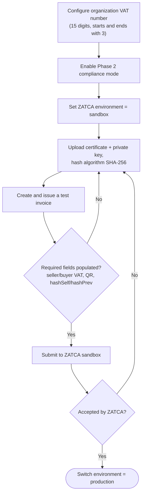
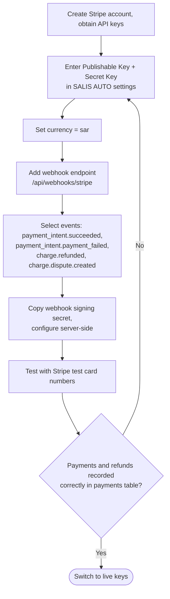
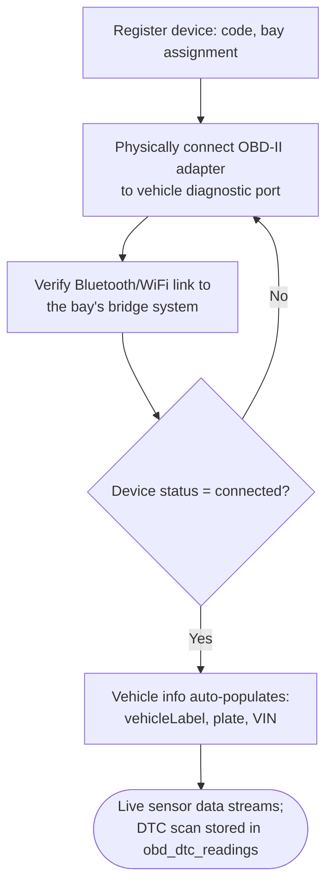

# How To: Setup Integrations

Diagrams for the three integrations with genuine multi-step setup procedures: ZATCA Phase 2 e-invoicing, the Stripe payment gateway, and OBD device pairing.

Source: [`docs/knowledge-base/how-to/setup-integrations.md`](../../knowledge-base/how-to/setup-integrations.md)

---

## ZATCA E-Invoicing Setup

---

## Stripe Payment Gateway Setup

---

## OBD Device Pairing

