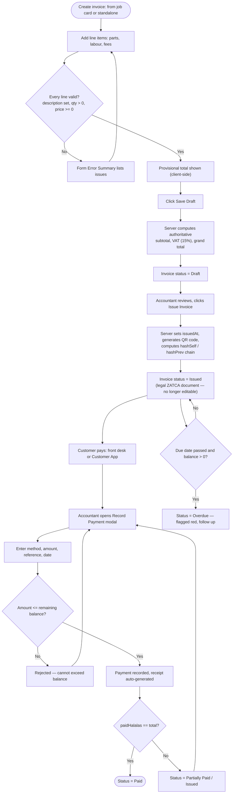
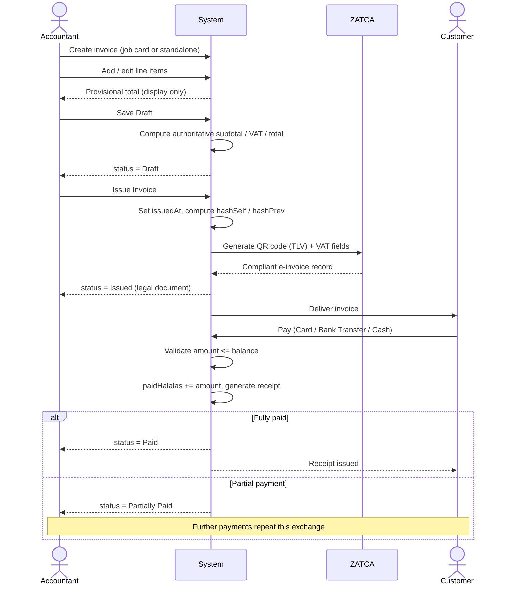

# Invoice & Payment Workflow

Diagrams for invoice creation, ZATCA-compliant issuance (QR code, hash chain), and payment recording through to receipt generation. All monetary totals are computed server-side — the client only displays a provisional figure while drafting.

Source: [`docs/user-documentation/workflows/invoice-payment.md`](../../user-documentation/workflows/invoice-payment.md)

---

## Process Flow: Draft to Paid

---

## Actor Interaction: Issuance and Payment

