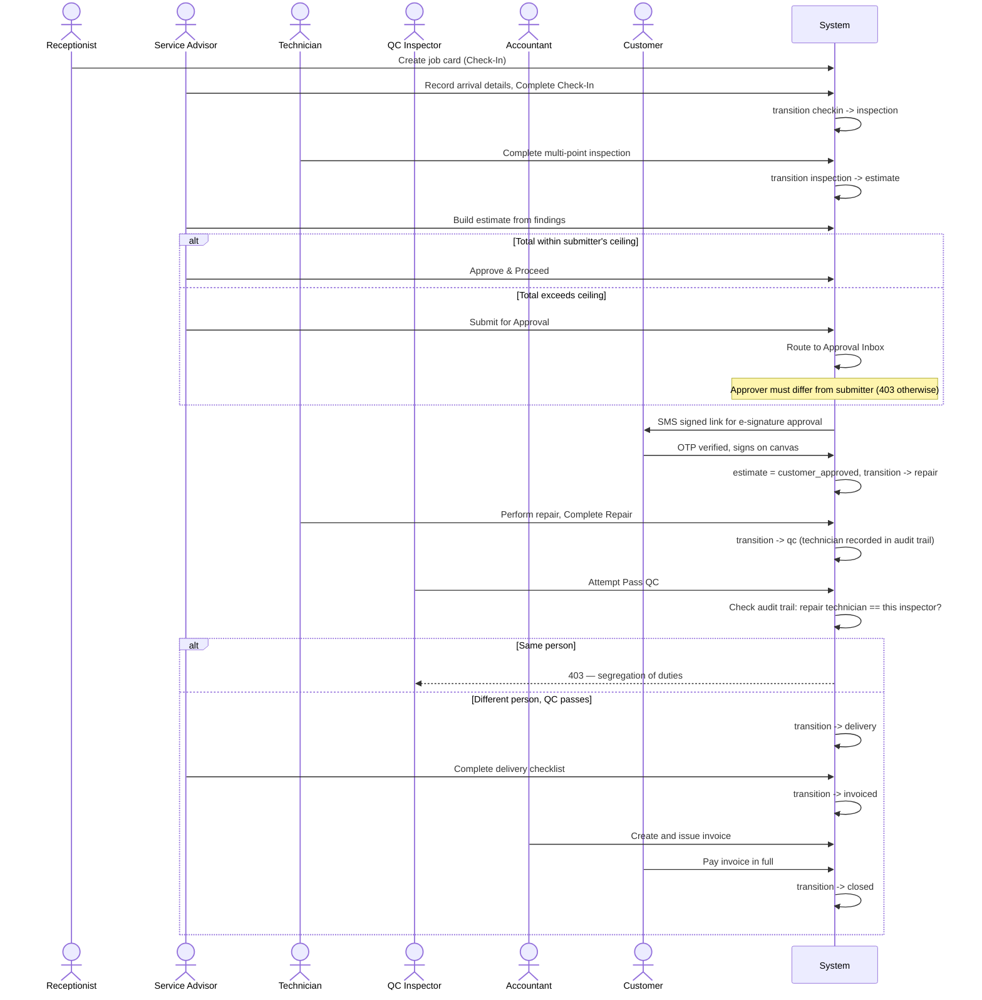

# Job Lifecycle Workflow

Diagrams for the eight-stage job card lifecycle in SALIS AUTO, from vehicle check-in through closure. Every stage is a server-enforced gate — stages cannot be skipped, and two segregation-of-duties controls (estimate approval, QC pass) block the same person from acting on both sides of a control point.

Source: [`docs/user-documentation/workflows/job-lifecycle.md`](../../user-documentation/workflows/job-lifecycle.md)

---

## Process Flow: Check-In through Closure

```mermaid
flowchart TD
    Start(["Vehicle arrives at workshop"]) --> CI1["Receptionist creates job card:<br/>customer, vehicle, service type, complaint, priority"]
    CI1 --> CI2["Service Advisor opens Check-In screen"]
    CI2 --> CI3["Record odometer, fuel level, belongings, reported issues, photos"]
    CI3 --> CI4["Click Complete Check-In"]
    CI4 -->|"POST /jobs/:id/transition"| INSP1["Technician opens Inspection screen"]

    INSP1 --> INSP2["Complete multi-point checklist:<br/>6 vehicle systems, Pass / Fail / N-A per item"]
    INSP2 --> INSP3{"All items have a verdict?"}
    INSP3 -->|"No"| INSP2
    INSP3 -->|"Yes"| EST1["Service Advisor builds Estimate<br/>from inspection findings (parts + labour)"]

    EST1 --> EST2{"Grand total vs. submitter's<br/>approval ceiling?"}
    EST2 -->|"Within ceiling"| EST3["Approve & Proceed"]
    EST2 -->|"Exceeds ceiling"| EST4["Submit for Approval -&gt;<br/>Approval Inbox"]
    EST4 --> EST5["Internal approver reviews and approves<br/>(see Estimate Approval Workflow)"]
    EST3 --> EST6["Customer e-signature approval<br/>(SMS + OTP + canvas signature)"]
    EST5 --> EST6
    EST6 --> REP1["Technician performs approved repair work"]

    REP1 --> REP2["Request parts via Parts Request screen<br/>Storekeeper issues from inventory"]
    REP2 --> REP3["Log time spent, document with photos/notes"]
    REP3 --> REP4["Click Complete Repair"]
    REP4 -->|"Technician recorded in audit trail"| QC1["QC Inspector opens QC screen"]

    QC1 --> QC2{"Same person who performed<br/>the repair attempting QC?"}
    QC2 -->|"Yes"| QC3["403 Forbidden — segregation of duties:<br/>repair technician cannot pass its own QC"]
    QC3 --> QC1
    QC2 -->|"No"| QC4["Complete QC checklist (6 checks)"]
    QC4 --> QC5{"Pass QC?"}
    QC5 -->|"No"| QC6["Return to Repair with correction notes"]
    QC6 --> REP1
    QC5 -->|"Yes"| DEL1["Service Advisor opens Delivery screen"]

    DEL1 --> DEL2["Complete Delivery checklist:<br/>notified, keys, documents, invoice, cleaned, QC verified"]
    DEL2 --> DEL3{"All 6 checklist items checked?"}
    DEL3 -->|"No"| DEL2
    DEL3 -->|"Yes"| DEL4["Click Complete Delivery"]
    DEL4 --> INV1["Accountant creates invoice from job card<br/>(see Invoice & Payment Workflow)"]
    INV1 --> INV2{"Invoice fully paid?"}
    INV2 -->|"No"| INV1
    INV2 -->|"Yes"| Closed(["Job Closed — system, automatic.<br/>Cannot be reopened or modified"])
```

---

## Actor Interaction: Stage Handoffs and Controls

