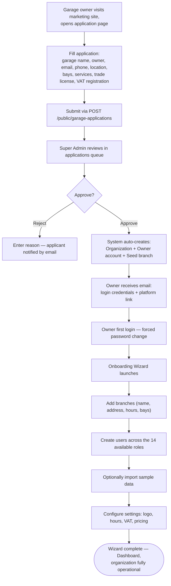
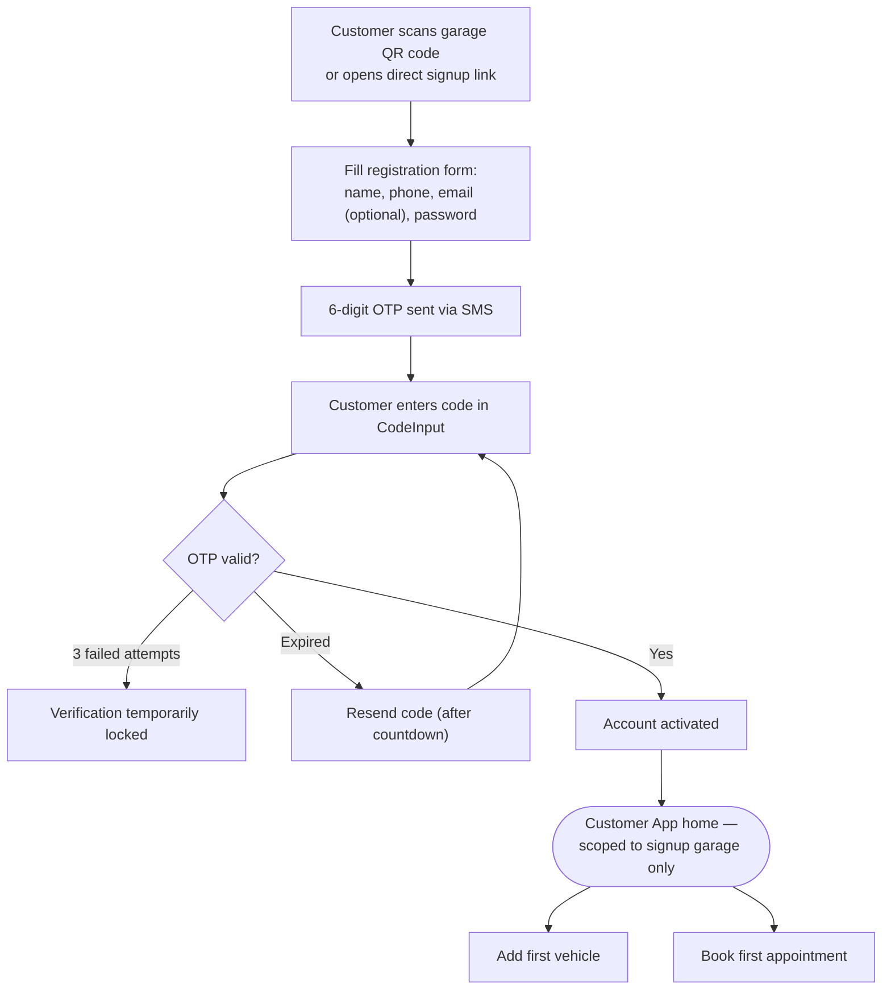
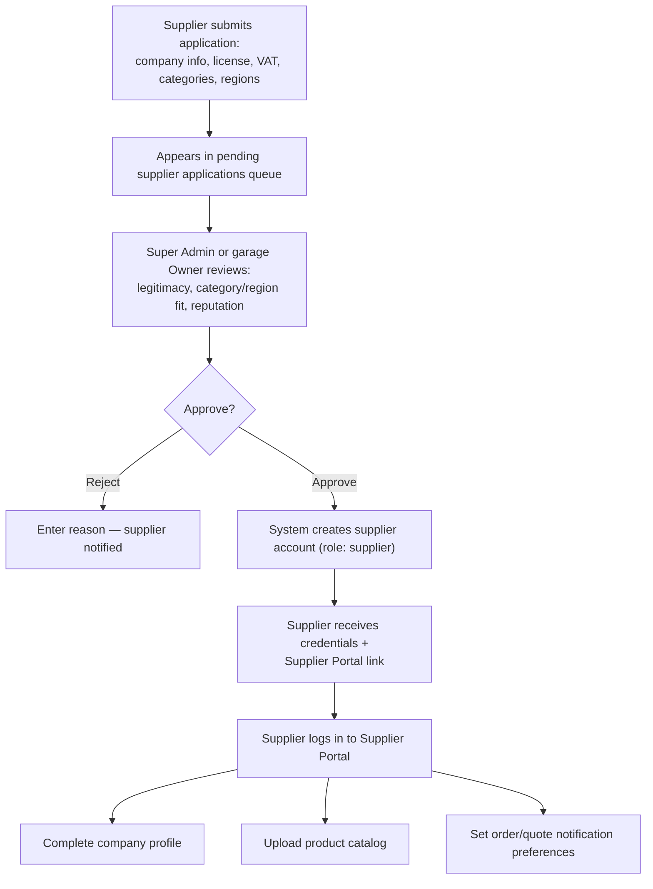
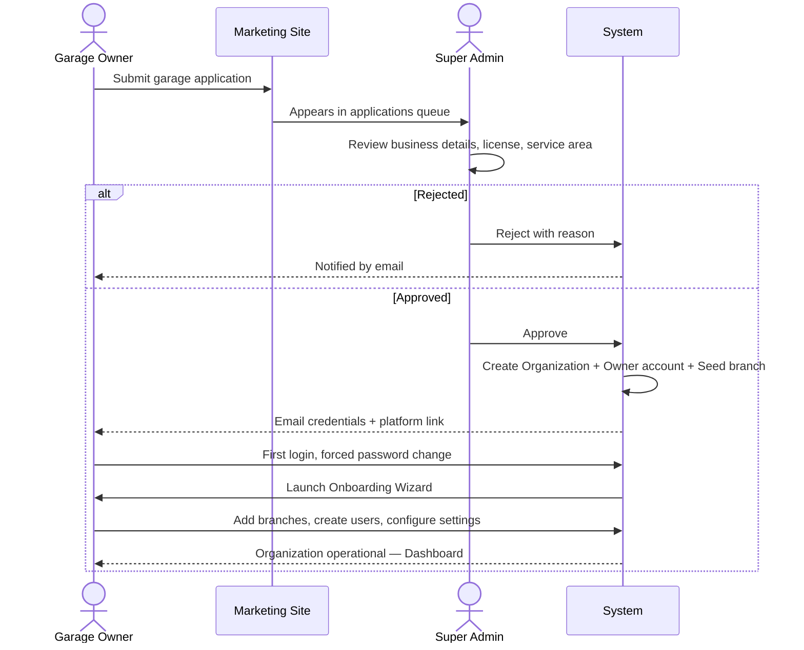

# Onboarding Flows

Diagrams for the three onboarding paths in SALIS AUTO: a garage owner applying to run their workshop on the platform, a customer self-signing-up for the Customer App, and a supplier applying for the Supplier Portal.

Source: [`docs/user-documentation/workflows/onboarding-flows.md`](../../user-documentation/workflows/onboarding-flows.md)

---

## Path A: Garage Onboarding

---

## Path B: Customer Signup

---

## Path C: Supplier Onboarding

---

## Actor Interaction: Garage Application Review (Path A)

---

## Related Flows

Post-onboarding, additional users/customers/suppliers are added through the administrative interface rather than self-service application — see [How To: Manage Users & Roles](how-to-manage-users-roles.md) for the ongoing user-creation flow.
