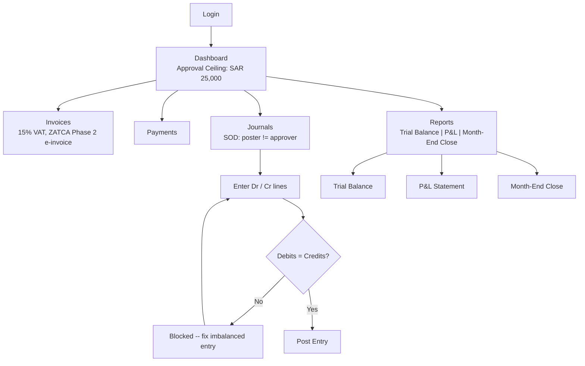
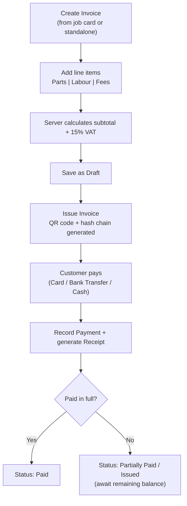
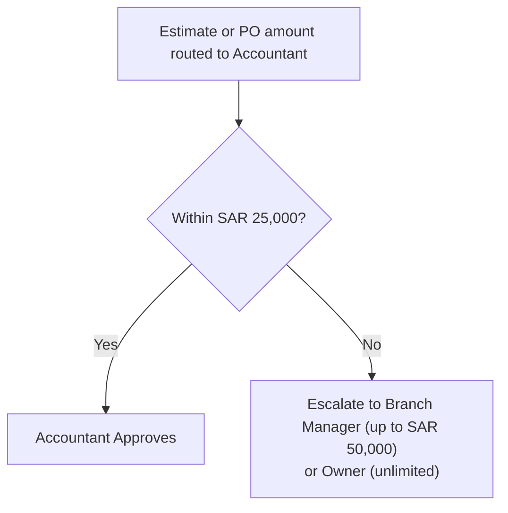

# Accountant Journey

The Accountant manages SALIS AUTO's financial backbone: chart of accounts, journal entries, invoices, payments, and ZATCA-compliant reporting, with an organization-wide scope and a SAR 25,000 approval ceiling. A key control is that the person who *posts* a journal entry cannot be the same person who *approves* it (segregation of duties).

## Primary Scenario: Daily Financial Operations

## Sub-Scenario: Invoice & Payment Cycle

## Sub-Scenario: Estimate / PO Approval Ceiling

**ZATCA compliance**: every issued invoice automatically generates seller/buyer VAT numbers, a QR code, and a tamper-evident hash chain (`hashSelf` linked to `hashPrev`) -- VAT is always computed server-side at 15%, never trusted from the browser.
