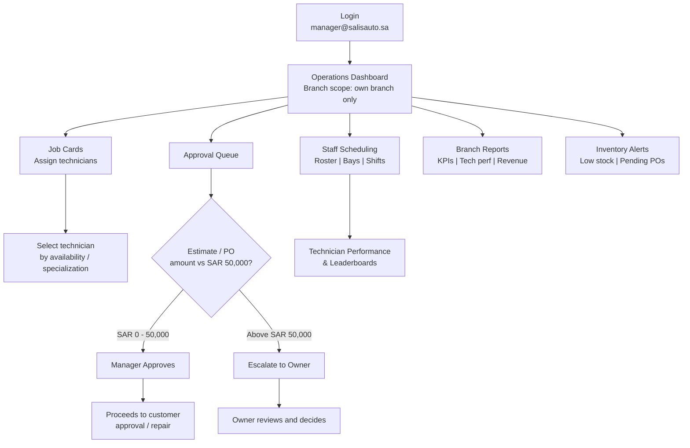
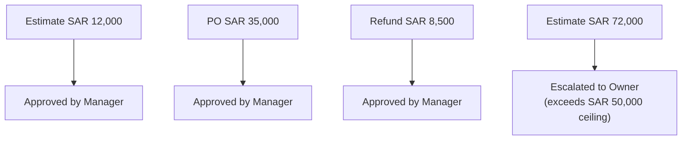

# Branch Manager Journey

The Branch Manager runs day-to-day operations for a single branch: assigning technicians, approving estimates and purchase orders up to SAR 50,000, scheduling staff, and monitoring branch KPIs. Their scope is strictly limited to their own branch -- other branches' data is hidden entirely, not just read-only. Anything above their SAR 50,000 ceiling escalates to the Owner.

## Primary Scenario: Daily Branch Operations

## Sub-Scenario: Approval Decision Examples

**Segregation of duties**: the Manager cannot approve an estimate they created themselves -- it is checked server-side and must go to the Owner or another authorized approver instead.

**Branch scoping**: the Manager's dashboard shows full detail for their own branch (active jobs, technicians, revenue, pending approvals, bay occupancy, inventory alerts) while every other branch is completely hidden from view.
