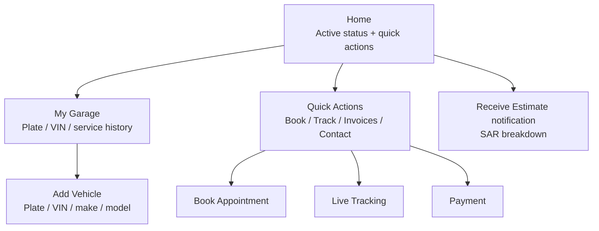
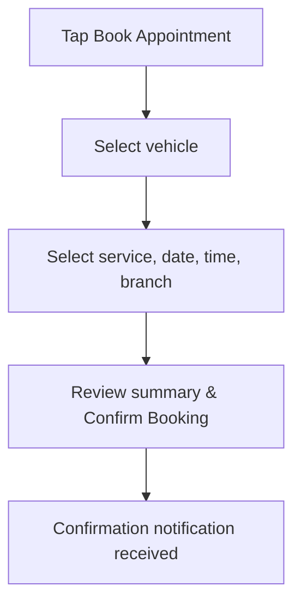
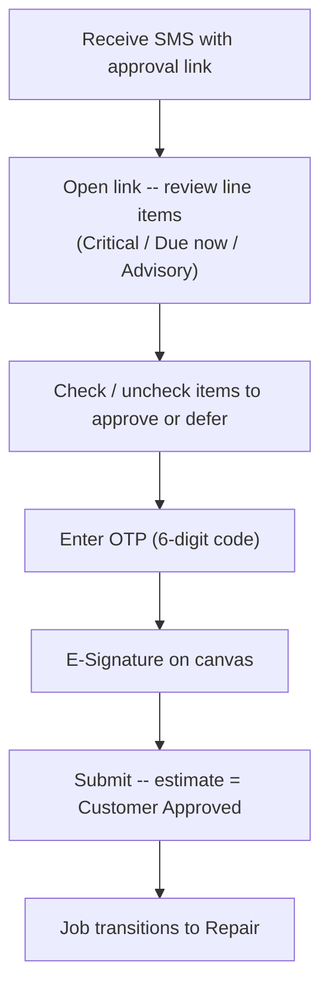
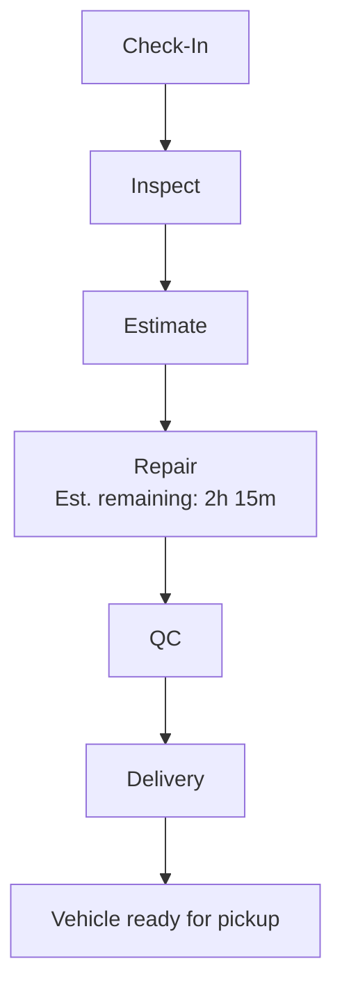
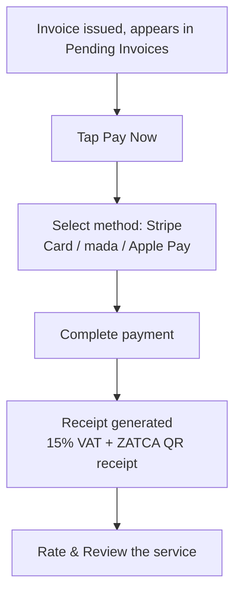

# Customer Journey

The Customer uses a mobile-first app to manage their vehicles, book service appointments, approve cost estimates, track repair progress in real time, and pay invoices. Unlike internal staff, the Customer's journey is made up of several genuinely separate sub-scenarios that a person dips in and out of over the life of a single service visit.

## Primary Scenario: App Navigation

## Sub-Scenario: Book Appointment

## Sub-Scenario: Approve Estimate (E-Signature)

## Sub-Scenario: Live Tracking

## Sub-Scenario: Payment & Review

