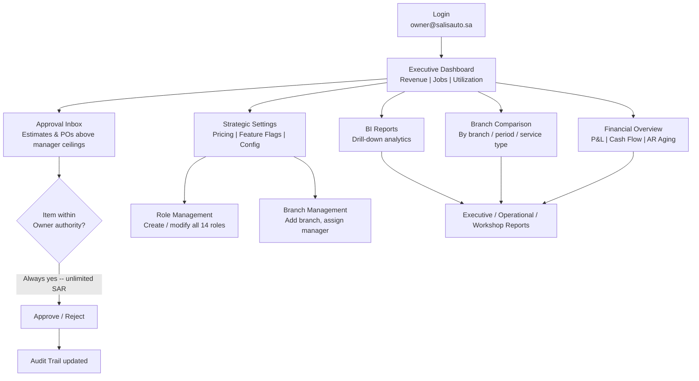
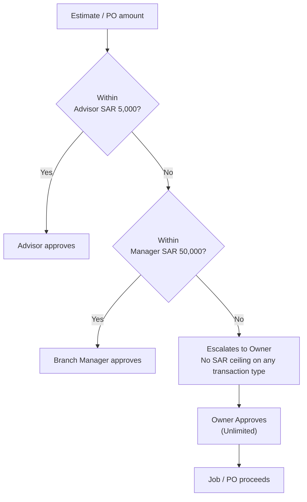

# Owner / CEO Journey

The Owner (or Super Admin) sits at the top of SALIS AUTO's 14-role hierarchy: unlimited approval ceiling, cross-branch visibility, and the only role that can touch tenant-wide configuration (pricing, feature flags, role definitions). Their primary scenario is daily strategic oversight -- scanning organization-wide KPIs, clearing the highest-value approvals, and comparing branch performance -- rather than hands-on workshop operations.

## Primary Scenario: Daily Strategic Oversight

## Sub-Scenario: Approval Escalation Chain (Owner's Position)

Every estimate or purchase order that exceeds a lower role's ceiling escalates upward until it reaches a role with sufficient authority. The Owner is the final, unlimited backstop -- nothing above them.

**Owner-exclusive capabilities** (unavailable to any other role, including Super Admin for tenant config): unlimited approvals, cross-branch aggregated view, tenant configuration (feature flags, pricing, branding), full role management across all 14 roles, and full audit-trail/compliance access.
