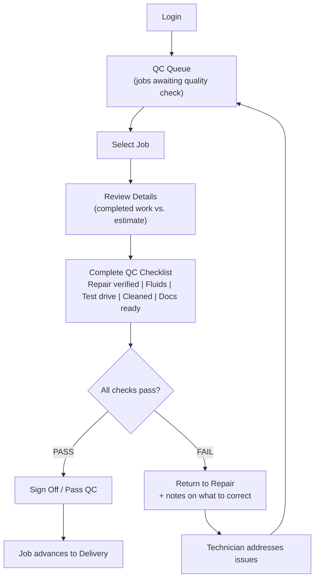
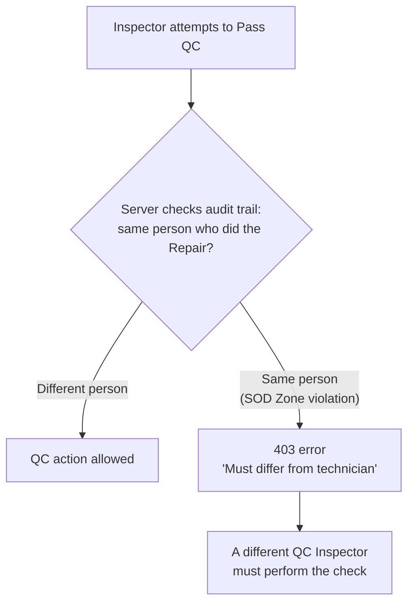

# QC Inspector Journey

The QC Inspector is the quality gate between Repair and Delivery -- an independent, branch-scoped role with a SAR 0 approval ceiling (they approve quality, not money). Their defining constraint is a server-enforced segregation-of-duties (SOD) rule: whoever performed the repair on a job can never be the one to pass its QC, even if they hold a more senior role.

## Primary Scenario: Quality Check Gate

## Sub-Scenario: Segregation-of-Duties Check

This control checks the actual individual, not just the role -- even a Branch Manager who personally performed a repair cannot pass QC on that same job.
