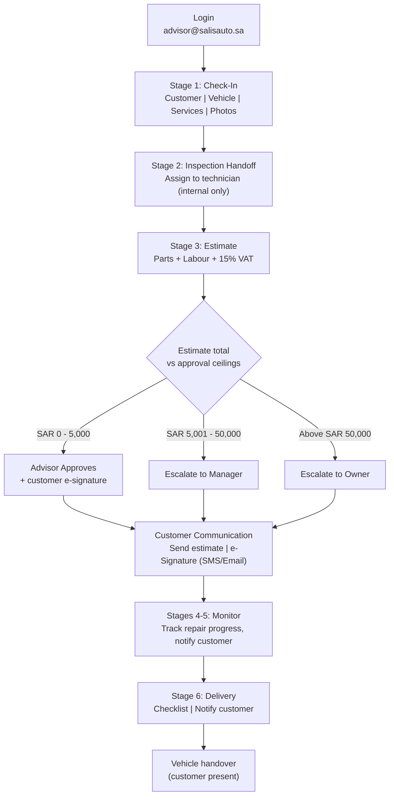
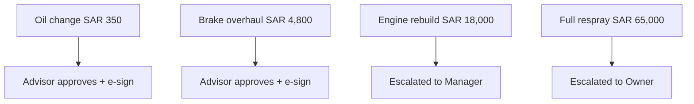
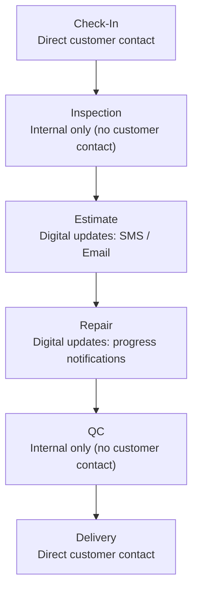

# Service Advisor Journey

The Service Advisor is the customer-facing hub of the workshop: they check vehicles in, hand off to the technician for inspection, build the cost estimate, coordinate customer e-signature approval, monitor repair progress, and deliver the vehicle. They can approve estimates up to SAR 5,000 directly (with customer e-signature); anything higher escalates up the approval chain.

## Primary Scenario: End-to-End Job Handling (Stages 1-6)

## Sub-Scenario: Approval Ceiling Examples

## Sub-Scenario: Customer Contact Touchpoints

Not every stage involves the customer directly -- this matters for how the Advisor coordinates communication.

All estimates include an automatic 15% VAT calculation per Saudi ZATCA requirements.
