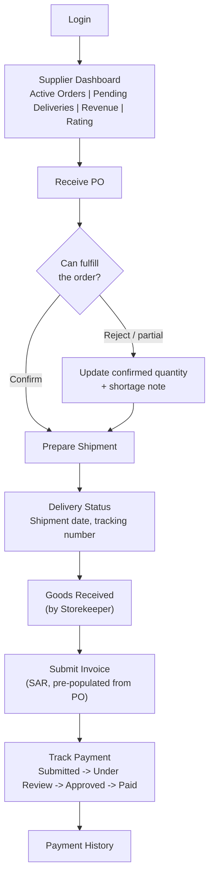
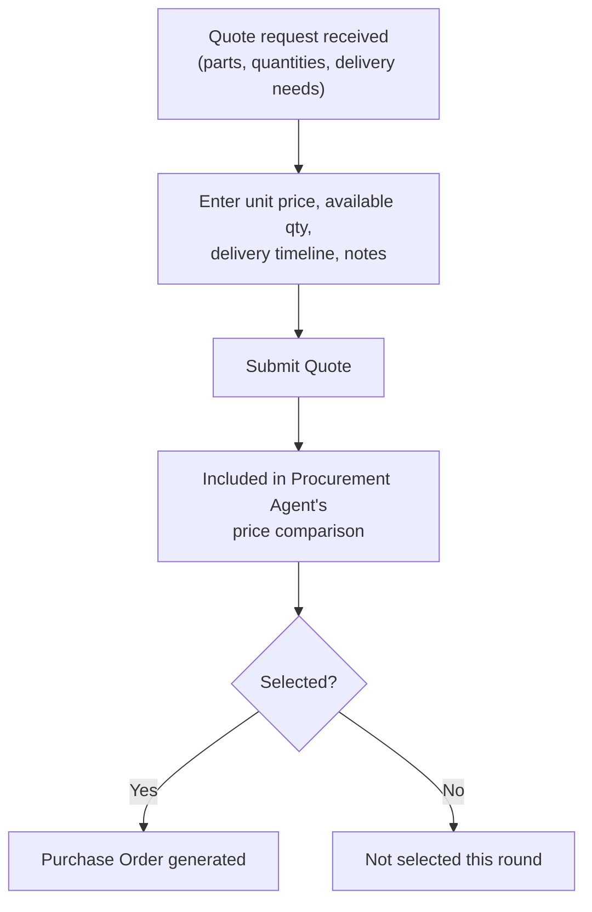
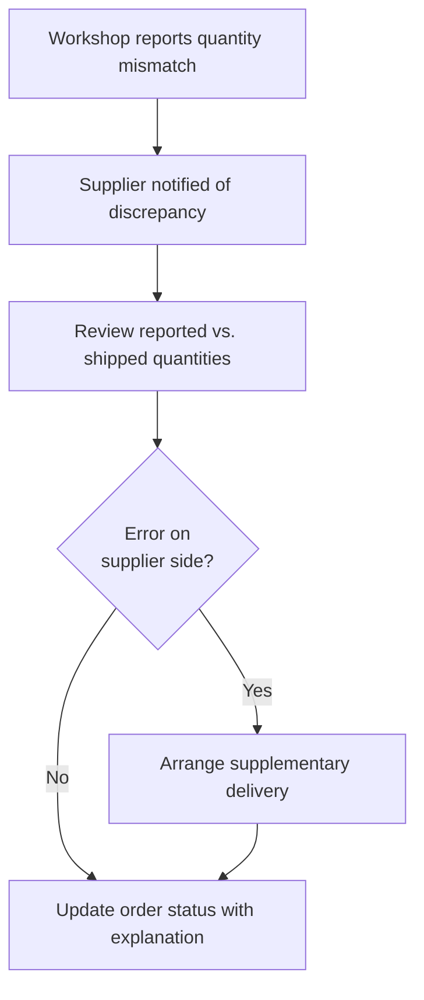

# Supplier Journey

The Supplier is an external portal role scoped to their own purchase orders and payments only -- they have no visibility into workshop operations, customer data, or other suppliers' transactions, and a SAR 0 approval ceiling (no approval authority). Their scenario centers on fulfilling purchase orders and getting paid for them.

## Primary Scenario: Order Fulfillment to Payment

## Sub-Scenario: Quote Request Response

## Sub-Scenario: Delivery Discrepancy Handling

**Boundary**: workshop-internal steps -- PO creation, goods receipt confirmation, and payment approval -- are performed by SALIS AUTO staff and are never visible to the supplier; the supplier only sees their own PO and payment status.
