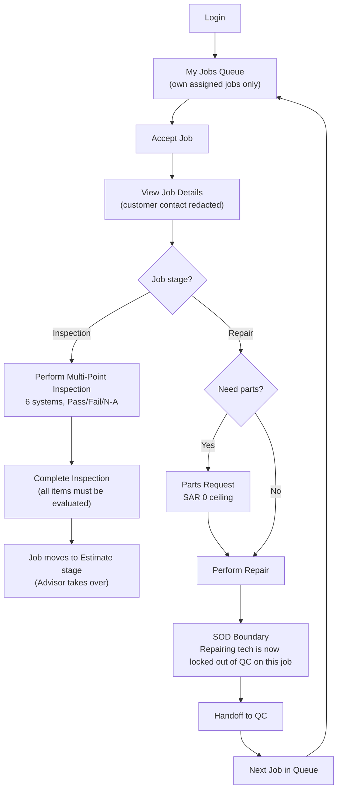
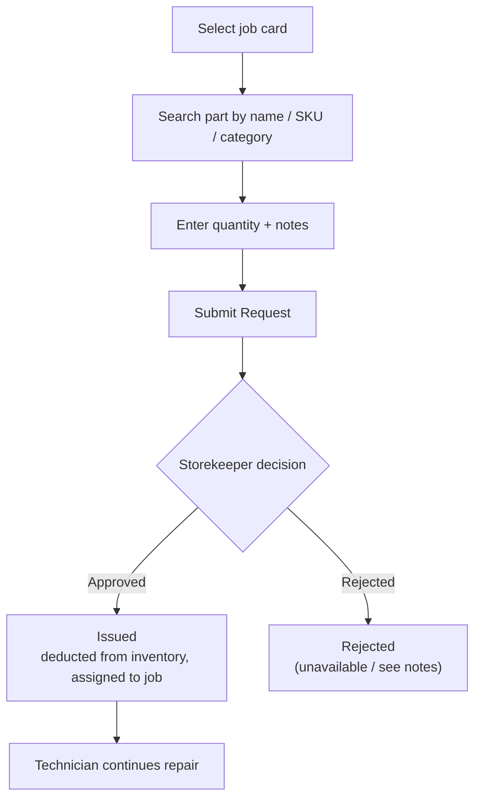

# Technician Journey

The Technician works the shop floor from a dedicated Technician Portal, scoped to only their own assigned jobs. Their scenario spans two of the six job-lifecycle stages -- Inspection and Repair -- plus requesting parts along the way. A hard segregation-of-duties (SOD) rule blocks them from ever passing QC on work they personally repaired.

## Primary Scenario: Job Queue to QC Handoff

## Sub-Scenario: Parts Request Flow

**Boundaries**: Technicians cannot see customer phone/email (redacted), cannot approve estimates (SAR 0 ceiling), cannot pass QC on their own repairs, cannot see financial figures, and can only see jobs assigned to them ("own" scope).
